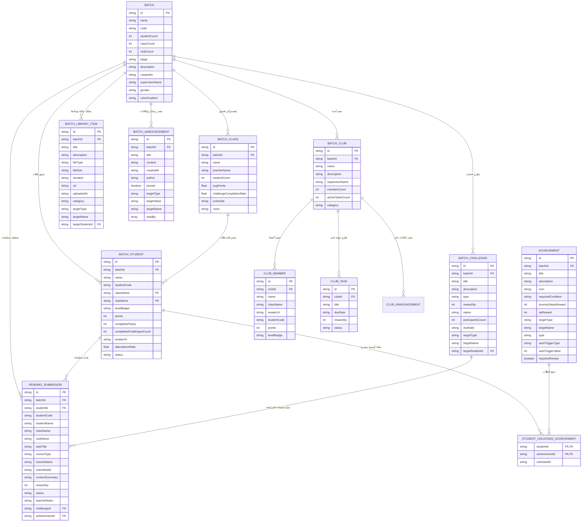

# 📊 وثيقة مخطط العلاقات وقواعد البيانات (ERD & Data Architecture Document)
## منصة رحلة داعية (Rihlat Da'eyah Educational Platform)

---

## 1. المقدمة ونظرة عامة (Overview)

توثّق هذه الوثيقة البنية الكاملة لقواعد البيانات ومخطط الكيانات والعلاقات (**Entity-Relationship Diagram - ERD**) لمنصة **رحلة داعية**. 
تم تصميم قواعد البيانات لتكون متوافقة مع قواعد البيانات العلاقية (Relational Databases مثل PostgreSQL / Supabase) ومع محرك التخزين المحلي التفاعلي (**Reactive Local Storage Store**) المعمول به في التطبيق.

---

## 2. مخطط الكيانات والعلاقات المرئي (Visual ERD Diagram)

---

## 3. التوصيف التفصيلي للجداول والكيانات (Detailed Entity Specifications)

### 3.1 جدول الدفعات (`BATCH`)
يُمثل الدفعة القرآنية أو المدرسة التي تضم عدة فصول وأندية وطلاب.

| اسم الحقل (Field) | النوع (Data Type) | القيود (Constraints) | الوصف (Description) |
|---|---|---|---|
| `id` | String / UUID | PRIMARY KEY | المعرف الفريد للدفعة |
| `name` | String | NOT NULL | اسم الدفعة (مثال: دفعة الفرقان) |
| `code` | String | UNIQUE | كود الدفعة للانضمام |
| `studentCount` | Integer | DEFAULT 0 | إجمالي عدد الطلاب |
| `classCount` | Integer | DEFAULT 0 | عدد الفصول بالدفعة |
| `clubCount` | Integer | DEFAULT 0 | عدد الأندية الأكاديمية |
| `stage` | String | NOT NULL | المرحلة الدراسية (ثانوي / متوسط / كبار) |
| `description` | Text | NULLABLE | شرح ووصف الدفعة |
| `createdAt` | DateTime / String | NOT NULL | تاريخ إنشاء الدفعة |
| `supervisorName` | String | NOT NULL | اسم المشرفة العامة للدفعة |
| `gender` | Enum | 'female' \| 'male' \| 'mixed' | نوع الدفعة |
| `colorGradient` | String | NULLABLE | التدرج اللونية للواجهة |

---

### 3.2 جدول الطلاب (`BATCH_STUDENT`)
يحتفظ ببيانات الطلاب ورصيد النقاط والشارات ورتب الرحلة.

| اسم الحقل (Field) | النوع (Data Type) | القيود (Constraints) | الوصف (Description) |
|---|---|---|---|
| `id` | String / UUID | PRIMARY KEY | المعرف الفريد للطالب |
| `batchId` | String / UUID | FOREIGN KEY ➡ BATCH.id | الدفعة التي ينتمي لها الطالب |
| `name` | String | NOT NULL | الاسم الثلاثي للطالب |
| `studentCode` | String | UNIQUE, NULLABLE | كود الطالب الموحد |
| `className` | String | FOREIGN KEY ➡ BATCH_CLASS.name | اسم الفصل المنتسب له |
| `clubName` | String | NULLABLE | اسم النادي المنتسب له |
| `levelBadge` | String | DEFAULT '🌱 البداية' | رتبة الطالبة في الرحلة |
| `points` | Integer | DEFAULT 0 | إجمالي نقاط الطالبة (XP) |
| `completedTasks` | Integer | DEFAULT 0 | عدد المهام المنجزة |
| `completedChallengesCount` | Integer | DEFAULT 0 | عدد التحديات المكتملة |
| `avatarUrl` | String | NULLABLE | رابط الصورة الشخصية |
| `attendanceRate` | Float | DEFAULT 100.0 | نسبة المواظبة والحضور |
| `status` | Enum | 'active' \| 'inactive' | حالة الطالب في النظام |

---

### 3.3 جدول الفصول الدراسية (`BATCH_CLASS`)
يُمثل الفصل الدراسي أو الحلقة القرآنية داخل الدفعة.

| اسم الحقل (Field) | النوع (Data Type) | القيود (Constraints) | الوصف (Description) |
|---|---|---|---|
| `id` | String / UUID | PRIMARY KEY | المعرف الفريد للفصل |
| `batchId` | String / UUID | FOREIGN KEY ➡ BATCH.id | الدفعة التابع لها الفصل |
| `name` | String | NOT NULL | اسم الفصل / الحلقة (مثل: فصل الأمل) |
| `teacherName` | String | NOT NULL | اسم معلّمة الحلقة |
| `studentCount` | Integer | DEFAULT 0 | عدد طالبات الفصل |
| `avgPoints` | Float | DEFAULT 0.0 | متوسط نقاط الفصل |
| `challengeCompletionRate` | Float | DEFAULT 0.0 | نسبة إنجاز التحديات بالفصل |
| `schedule` | String | NULLABLE | مواعيد الحلقة |
| `room` | String | NULLABLE | القاعة أو رابط الحلقة الافتراضية |

---

### 3.4 جدول الأندية والأنشطة (`BATCH_CLUB`)
يُمثل النادي الطلابي التخصصي (مثل نادي الإذاعة أو التقنية أو القرّاء).

| اسم الحقل (Field) | النوع (Data Type) | القيود (Constraints) | الوصف (Description) |
|---|---|---|---|
| `id` | String / UUID | PRIMARY KEY | المعرف الفريد للنادي |
| `batchId` | String / UUID | FOREIGN KEY ➡ BATCH.id | الدفعة التابع لها النادي |
| `name` | String | NOT NULL | اسم النادي |
| `description` | Text | NULLABLE | وصف أهداف النادي |
| `supervisorName` | String | NOT NULL | معلّمة / مشرفة النادي |
| `memberCount` | Integer | DEFAULT 0 | عدد الأعضاء المنضمين |
| `activeTasksCount` | Integer | DEFAULT 0 | عدد المهام النشطة |
| `category` | String | NOT NULL | تصنيف النادي (ثقافي/إعلامي/قرآني) |

---

### 3.5 جدول التحديات (`BATCH_CHALLENGE` / `CHALLENGE`)
يحتفظ بالتحديات اليومية والأسبوعية والشهرية المطروحة للطلاب.

| اسم الحقل (Field) | النوع (Data Type) | القيود (Constraints) | الوصف (Description) |
|---|---|---|---|
| `id` | String / UUID | PRIMARY KEY | المعرف الفريد للتحدي |
| `batchId` | String / UUID | FOREIGN KEY ➡ BATCH.id | الدفعة المستهدفة |
| `title` | String | NOT NULL | عنوان التحدي |
| `description` | Text | NULLABLE | تفاصيل وشروط التحدي |
| `type` / `category` | Enum | 'daily' \| 'weekly' \| 'monthly' | نوع التحدي (يومي/أسبوعي/شهري) |
| `rewardXp` / `xp_reward` | Integer | DEFAULT 50 | مكافأة XP عند الإنجاز |
| `status` | Enum | 'active' \| 'upcoming' \| 'completed' | حالة التحدي |
| `participantsCount` | Integer | DEFAULT 0 | عدد المشاركين |
| `dueDate` | String / Date | NULLABLE | موعد انتهاء التحدي |
| `targetType` | Enum | 'all' \| 'batch' \| 'class' \| 'club' \| 'student' | نطاق التوجيه |
| `targetName` | String | NULLABLE | اسم الجهة المستهدفة |
| `targetStudentId` | String / UUID | FOREIGN KEY ➡ BATCH_STUDENT.id, NULLABLE | المعرف عند التوجيه لشخص محدد |

---

### 3.6 جدول تسليمات الطلاب للمراجعة (`PENDING_SUBMISSION`)
يُسجل إجابات الطلاب المرفوعة للتحديات ومهام الأندية في انتظار مراجعة وتدقيق المعلمة.

| اسم الحقل (Field) | النوع (Data Type) | القيود (Constraints) | الوصف (Description) |
|---|---|---|---|
| `id` | String / UUID | PRIMARY KEY | المعرف الفريد للتسليم |
| `batchId` | String / UUID | FOREIGN KEY ➡ BATCH.id | الدفعة التابع لها التسليم |
| `studentId` | String / UUID | FOREIGN KEY ➡ BATCH_STUDENT.id | المعرف الفريد للطالب |
| `studentName` | String | NOT NULL | اسم الطالب |
| `className` | String | NOT NULL | اسم فصل الطالب |
| `taskTitle` | String | NOT NULL | عنوان المهمة أو التحدي |
| `sourceType` | Enum | 'club' \| 'challenge' \| 'achievement' \| 'regular' | مصدر المهمة |
| `sourceName` | String | NOT NULL | اسم المصدر |
| `submittedAt` | DateTime / String | NOT NULL | تاريخ ووقت التقديم |
| `contentSummary` | Text | NOT NULL | إجابة الطالب أو رابط الإنجاز |
| `rewardXp` | Integer | DEFAULT 50 | النقاط المستحقة عند القبول |
| `status` | Enum | 'pending' \| 'approved' \| 'rejected' | حالة المراجعة |
| `teacherNotes` | Text | NULLABLE | ملاحظات وثناء المعلمة |

---

### 3.7 جدول رسائل وإعلانات المعلمة (`BATCH_ANNOUNCEMENT`)
يحتفظ بالرسائل المباشرة والإعلانات الصادرة من المعلمة مع تتبع القراءة.

| اسم الحقل (Field) | النوع (Data Type) | القيود (Constraints) | الوصف (Description) |
|---|---|---|---|
| `id` | String / UUID | PRIMARY KEY | المعرف الفريد للرسالة |
| `batchId` | String / UUID | FOREIGN KEY ➡ BATCH.id | الدفعة التابعة لها |
| `title` | String | NOT NULL | عنوان الرسالة |
| `content` | Text | NOT NULL | نص الرسالة |
| `createdAt` | DateTime / String | NOT NULL | وقت وتاريخ الإرسال |
| `author` | String | DEFAULT 'معلمة الدفعة' | اسم المعلمة المرسلة |
| `pinned` | Boolean | DEFAULT false | هل الرسالة مثبتة؟ |
| `targetType` | Enum | 'batch' \| 'class' \| 'club' \| 'student' \| 'all' | نوع التوجيه |
| `targetValue` | String | NULLABLE | المعرف/الاسم المستهدف |
| `targetName` | String | NULLABLE | الاسم الظاهر للمجموعة المستهدفة |
| `readBy` | Array of Strings | DEFAULT [] | قائمة معرّفات الطلاب الذين قرؤوا الرسالة |

---

### 3.8 جدول المكتبة الرقمية (`BATCH_LIBRARY_ITEM`)
يخزن الوسائط والملفات التعليمية المرفوعة من قبل المشرفات.

| اسم الحقل (Field) | النوع (Data Type) | القيود (Constraints) | الوصف (Description) |
|---|---|---|---|
| `id` | String / UUID | PRIMARY KEY | المعرف الفريد للملف |
| `batchId` | String / UUID | FOREIGN KEY ➡ BATCH.id, NULLABLE | الدفعة التابع لها |
| `title` | String | NOT NULL | عنوان المادة العلمية |
| `description` | Text | NULLABLE | شرح وتفاصيل المادة |
| `fileType` | Enum | 'pdf' \| 'video' \| 'audio' \| 'image' \| 'link' \| 'doc' | نوع الملف |
| `fileSize` | String | NULLABLE | حجم الملف |
| `duration` | String | NULLABLE | المدة الزمنية للملفات الصوتية والمرئية |
| `url` | String | NOT NULL | رابط التحميل أو المعاينة |
| `uploadedAt` | DateTime / String | NOT NULL | تاريخ الرفع |
| `category` | String | DEFAULT 'عام' | التصنيف التعليمي |
| `targetType` | Enum | 'all' \| 'batch' \| 'club' \| 'student' | الجمهور المستهدف |

---

## 4. سياسات التكامل وحساب النقاط (Persistence & Computation Strategy)

1. **حساب الرتب التلقائي (Level Badge Computation)**:
   يتم تحديث `levelBadge` للطالب تلقائياً بناءً على رصيد نقاطه (`points`):
   - `0 - 199 XP` ⬅️ 🌱 البداية
   - `200 - 499 XP` ⬅️ 📖 طالب علم
   - `500 - 999 XP` ⬅️ ⭐ مجتهد
   - `1000 - 1799 XP` ⬅️ 💎 متميز
   - `1800 - 2799 XP` ⬅️ 🌟 مؤثر
   - `2800+ XP` ⬅️ 👑 قدوة

2. **تزامن البيانات وتأكيد القراءة (Real-time Event Synchronization)**:
   عند إضافة تسليم جديد أو تغيير حالة مراجعة أو إضافة رسالة معلمة، يتم إطلاق الحدث `window.dispatchEvent(new CustomEvent('rihlat_db_updated'))` لتحديث كافة المكونات المفتوحة مباشرة وبدون الحاجة لإعادة تحميل الصفحة.

---
*تم تحرير هذا المخطط رسمياً لمنظومة رحلة داعية.*
